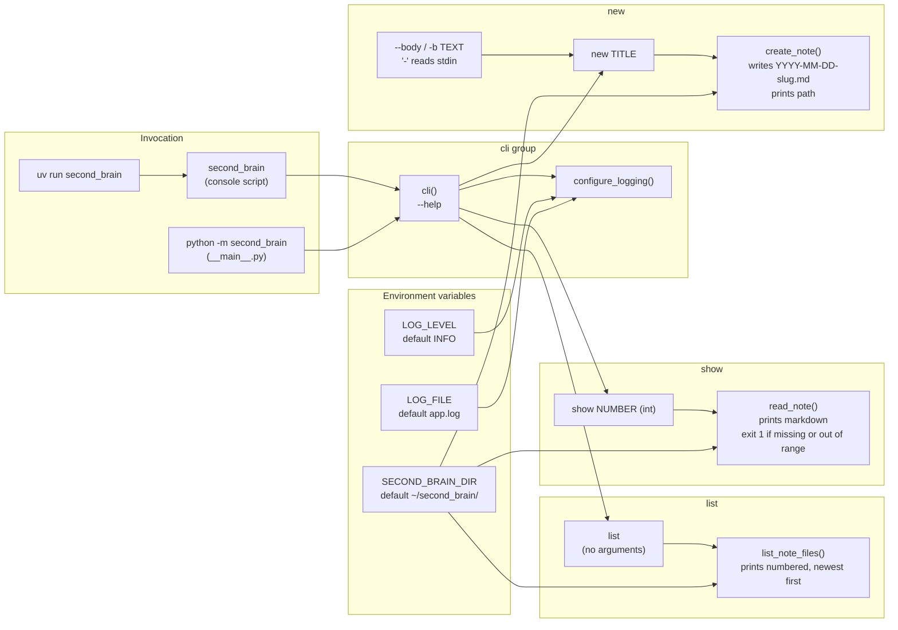

# Entry Points

Three ways to start the CLI, all landing on the same `cli()` click group.
Arguments, options and environment variables per command are shown with what
each one reaches.

```mermaid
flowchart LR
    subgraph start["Invocation"]
        e1["second_brain<br/>(console script)"]
        e2["python -m second_brain<br/>(__main__.py)"]
        e3["uv run second_brain"]
    end

    subgraph env["Environment variables"]
        v_level["LOG_LEVEL<br/>default INFO"]
        v_file["LOG_FILE<br/>default app.log"]
        v_dir["SECOND_BRAIN_DIR<br/>default ~/second_brain/"]
    end

    subgraph group["cli group"]
        grp["cli()<br/>--help"]
        logcfg["configure_logging()"]
    end

    subgraph c_new["new"]
        new_cmd["new TITLE"]
        new_body["--body / -b TEXT<br/>'-' reads stdin"]
        new_impl["create_note()<br/>writes YYYY-MM-DD-slug.md<br/>prints path"]
    end

    subgraph c_list["list"]
        list_cmd["list<br/>(no arguments)"]
        list_impl["list_note_files()<br/>prints numbered, newest first"]
    end

    subgraph c_show["show"]
        show_cmd["show NUMBER (int)"]
        show_impl["read_note()<br/>prints markdown<br/>exit 1 if missing or out of range"]
    end

    e1 --> grp
    e2 --> grp
    e3 --> e1
    grp --> logcfg
    v_level --> logcfg
    v_file --> logcfg

    grp --> new_cmd
    grp --> list_cmd
    grp --> show_cmd

    new_body --> new_cmd
    new_cmd --> new_impl
    list_cmd --> list_impl
    show_cmd --> show_impl

    v_dir --> new_impl
    v_dir --> list_impl
    v_dir --> show_impl
```
