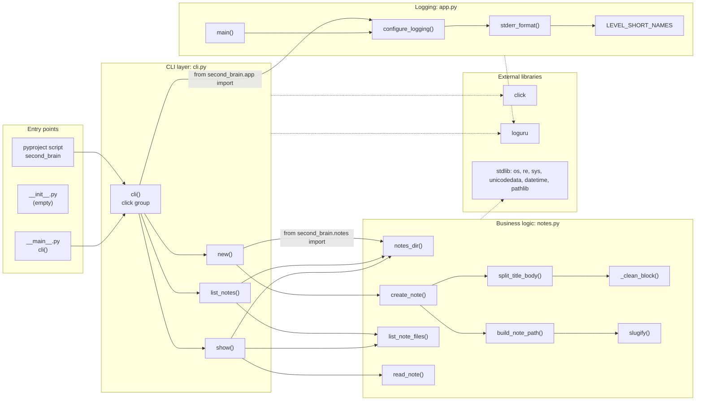

# Package Overview

Files, functions and import relationships of `second_brain`.
Solid arrows are imports/calls; dashed arrows are external dependencies.

```mermaid
flowchart LR
    subgraph ext["External libraries"]
        click_lib["click"]
        loguru_lib["loguru"]
        stdlib["stdlib: os, re, sys, unicodedata, datetime, pathlib"]
    end

    subgraph entry["Entry points"]
        main_py["__main__.py<br/>cli()"]
        init_py["__init__.py<br/>(empty)"]
        script["pyproject script<br/>second_brain"]
    end

    subgraph cli_layer["CLI layer: cli.py"]
        cli_group["cli()<br/>click group"]
        cmd_new["new()"]
        cmd_list["list_notes()"]
        cmd_show["show()"]
    end

    subgraph logging_layer["Logging: app.py"]
        configure["configure_logging()"]
        fmt["stderr_format()"]
        short_names["LEVEL_SHORT_NAMES"]
        app_main["main()"]
    end

    subgraph notes_layer["Business logic: notes.py"]
        notes_dir_fn["notes_dir()"]
        create["create_note()"]
        split["split_title_body()"]
        clean["_clean_block()"]
        build["build_note_path()"]
        slug["slugify()"]
        list_files["list_note_files()"]
        read_fn["read_note()"]
    end

    script --> cli_group
    main_py --> cli_group

    cli_group --> cmd_new
    cli_group --> cmd_list
    cli_group --> cmd_show
    cli_group -->|"from second_brain.app import"| configure

    cmd_new -->|"from second_brain.notes import"| notes_dir_fn
    cmd_new --> create
    cmd_list --> notes_dir_fn
    cmd_list --> list_files
    cmd_show --> notes_dir_fn
    cmd_show --> list_files
    cmd_show --> read_fn

    configure --> fmt
    fmt --> short_names
    app_main --> configure

    create --> split
    create --> build
    split --> clean
    build --> slug

    cli_layer -.-> click_lib
    cli_layer -.-> loguru_lib
    logging_layer -.-> loguru_lib
    notes_layer -.-> stdlib
```
