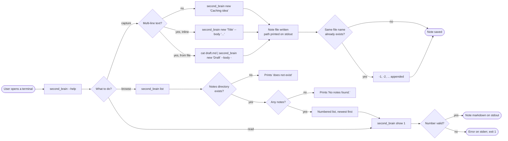

# Example User Flow

A typical session: capture a note, find it again, read it, and handle errors.

```mermaid
flowchart LR
    start(["User opens a terminal"]) --> help["second_brain --help"]
    help --> choose{"What to do?"}

    choose -->|"capture"| new_q{"Multi-line text?"}
    new_q -->|"no"| new_simple["second_brain new 'Caching idea'"]
    new_q -->|"yes, inline"| new_body["second_brain new 'Title' --body '...'"]
    new_q -->|"yes, from file"| new_stdin["cat draft.md | second_brain new 'Draft' --body -"]

    new_simple --> written["Note file written<br/>path printed on stdout"]
    new_body --> written
    new_stdin --> written
    written --> dup{"Same file name<br/>already exists?"}
    dup -->|"yes"| suffix["-1, -2, ... appended"]
    dup -->|"no"| saved(["Note saved"])
    suffix --> saved

    choose -->|"browse"| list_cmd["second_brain list"]
    list_cmd --> dir_ok{"Notes directory<br/>exists?"}
    dir_ok -->|"no"| no_dir["Prints 'does not exist'"]
    dir_ok -->|"yes"| has_notes{"Any notes?"}
    has_notes -->|"no"| none["Prints 'No notes found.'"]
    has_notes -->|"yes"| numbered["Numbered list, newest first"]

    numbered --> show_cmd["second_brain show 1"]
    choose -->|"read"| show_cmd
    show_cmd --> valid{"Number valid?"}
    valid -->|"yes"| content(["Note markdown on stdout"])
    valid -->|"no"| err(["Error on stderr, exit 1"])
```
